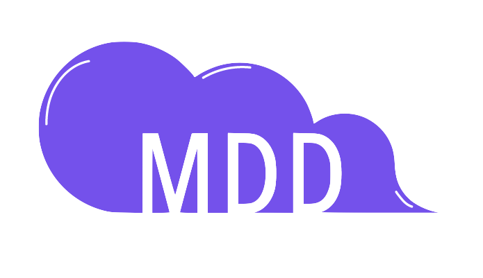

# P6-Full-Stack-reseau-dev

<div style="text-align: center;">

</div>

<h1 style="text-align: center;">Monde de Dev</h1>
<br>

Monde de Dev (MDD) est un réseau social dédié aux développeurs. Ce MVP (Minimum Viable Product) permet de :
- S’abonner à des sujets de programmation (JavaScript, Java, Python, Web3, etc.)
- Consulter un fil d’actualité personnalisé contenant les articles des topics auxquels l’utilisateur est abonné
- Rédiger des articles (posts) et les catégoriser par topic
- Interagir via des commentaires sur chaque article

Toutes les fonctionnalités essentielles sont exposées via une API RESTful sécurisée par JWT, sans back-office.

---

## Repository structure
```
MDD/
├── back/ # API Spring Boot
│ ├── src/
│ ├── pom.xml
│ └── README.md
├── front/ # Application Angular
│ ├── src/
│ ├── angular.json
│ └── README.md
└── resources/ # Outils et scripts (postman, SQL, assets)
└── ...
```

Chaque dossier contient son **README.md** dédié avec les instructions d’installation et d’utilisation.

---

## ✨ Features

- **Authentication & Users**
    - Inscription et connexion (JWT)
    - Gestion du profil (mise à jour email, nom d’utilisateur, mot de passe)
    - Déconnexion et sécurisation des routes

- **Topics Management**
    - Liste et création de topics
    - Abonnement / désabonnement aux topics
    - Affichage conditionnel des boutons selon le contexte (Topics vs Profil)

- **Posts & Comments**
    - Fil d’actualité personnalisé trié par date
    - Création, lecture et tri des articles
    - Ajout et affichage de commentaires (limite 500 caractères)

---

## 🛠 Technologies

- **Backend** : Java 23, Spring Boot 3.4.5, Hibernate, MySQL 8.5, Spring Security (JWT), Swagger/OpenAPI
- **Frontend** : Angular 19, TypeScript, Angular Material, RxJS, SCSS
- **Outils** : Maven, Node.js 22.14.0, npm 11.2.0, OpenSSL (pour clés JWT)

---

## 📋 Requirements

- Java 23 (JDK)
- Maven 3.8+
- MySQL 8.0+
- Node.js 22.14.0 & npm 11.2.0
- Angular CLI 19+

---

*Prêt·e·s à plonger dans le Monde de Dev ?* 🚀

